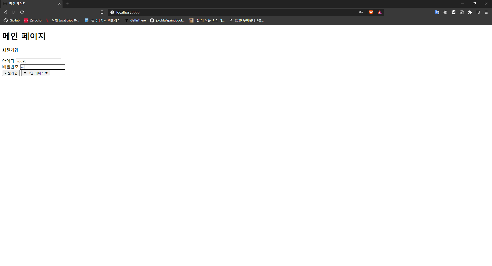
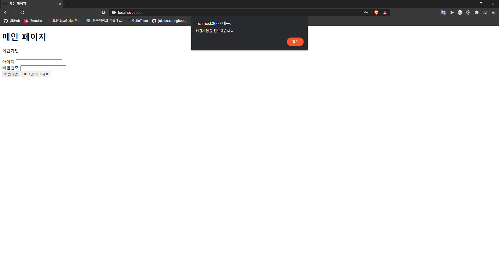
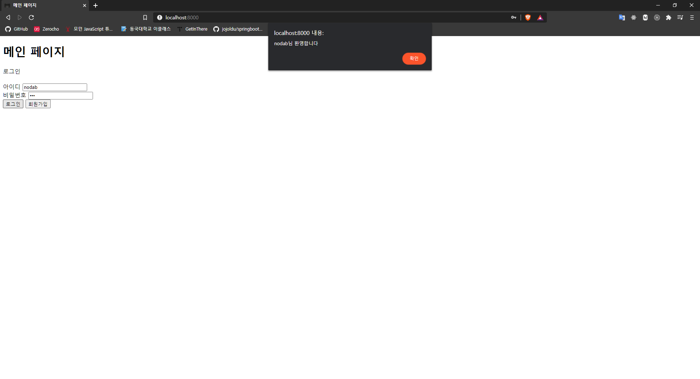
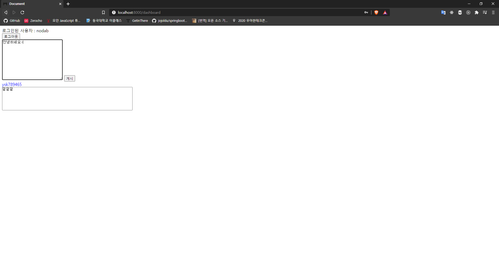
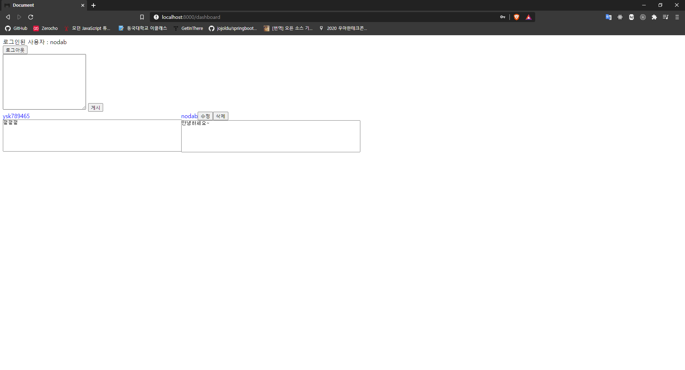
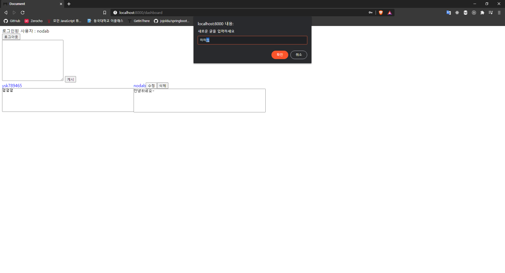
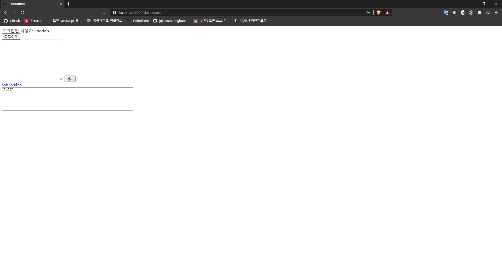
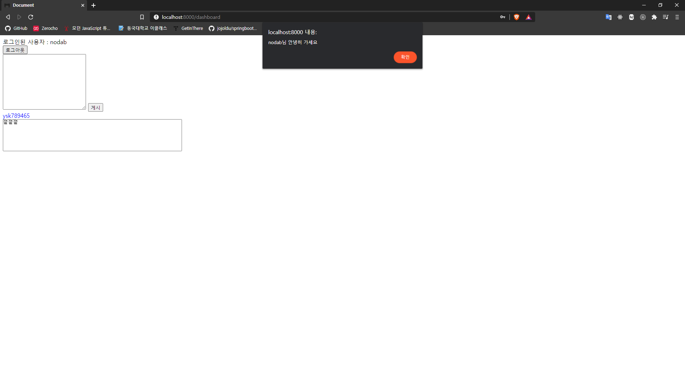

# No_express_dashboard

## 개요

- nodejs를 사용할 때 웹 서버 제작에 편리한 기능을 제공하는 express를 사용하지 않고 내장 http 모듈을 사용하여 구현한 간단한 대시보드 웹사이트
- 세션 정보를 json 파일에 저장하는 방식으로 로그아웃을 하지 않는 한 창을 닫아도 로그인이 지속됨
- DBMS를 사용하지 않고 json 파일에 user, session, dashboard 데이터를 저장

### 구현한 기능

- 로그인
- 로그아웃
- 회원가입
- 방명록 남기기
- 방명록 수정 및 삭제(로그인한 유저의 경우)

### 구현 화면

1. 회원가입
   
   

2. 로그인
   

3. 새로운 게시글 추가
   
   

4. 기존 게시글 수정
   
   

5. 기존 게시글 삭제
   

6. 로그아웃
   
